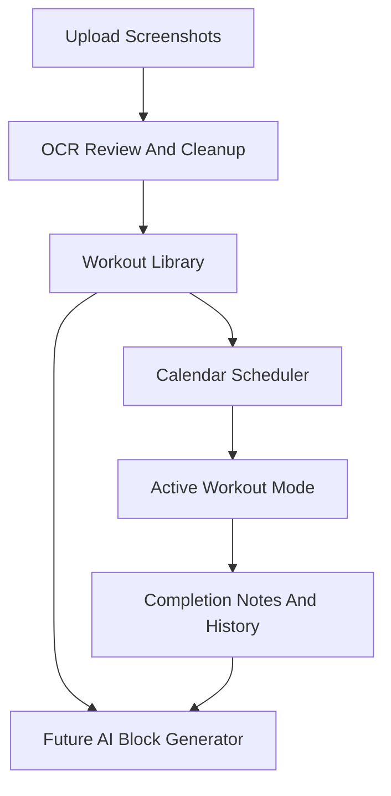

# Workout Calendar Plan

## Direction

We will bootstrap a new Next.js App Router app in the empty repo and keep v1 solo/local-first: no login, no backend account system, and no database required at first. The app will store workouts, uploaded screenshots, OCR text, scheduled sessions, and completion notes locally in the browser using IndexedDB, with JSON export/import so the data is not trapped.

The product model should be a workout library plus a calendar, not just one screenshot per date. Screenshots become reusable workout templates tagged by functional-strength qualities like push, pull, squat, hinge, core, mobility, conditioning, unilateral work, balance, and body area.

The visual direction should borrow from the Book Grid UI in [../billy-portfolio](../billy-portfolio): crisp editorial layout, thin rules, numbered section labels, restrained typography, strong grid rhythm, low-radius cards, and responsive columns that collapse cleanly on mobile. Use large numeric typography as a signature element for dates, workout steps, sets, reps, rest periods, and progress. The workout site should feel calmer and more utilitarian than a fitness app, while still being easy to scan during exercise.

## Phase 1: Import, Organize, Schedule

Create the base app and core UI at:

- [app/page.tsx](app/page.tsx) for the main dashboard/calendar shell
- [app/layout.tsx](app/layout.tsx) for app metadata and shared layout
- [components/workout-upload.tsx](components/workout-upload.tsx) for screenshot uploads
- [components/ocr-review.tsx](components/ocr-review.tsx) for reviewing extracted text
- [components/workout-library.tsx](components/workout-library.tsx) for filtering/tagging workouts
- [components/calendar-board.tsx](components/calendar-board.tsx) for scheduling workouts
- [components/book-grid-shell.tsx](components/book-grid-shell.tsx) for the editorial grid/rules layout system
- [lib/workout-types.ts](lib/workout-types.ts) for the shared data model
- [lib/local-store.ts](lib/local-store.ts) for IndexedDB persistence

Use OCR-assisted import: upload screenshots, run OCR in-browser, then show a review form where the extracted workout can be corrected before it becomes a structured template. Keep the original screenshot attached to each workout so you can always compare against the source.

Suggested v1 workout fields:

- Name
- Source screenshot
- OCR raw text
- Clean instructions
- Tags: movement pattern, body area, equipment, intensity, duration, functional focus
- Progression notes
- Scheduling notes

## Phase 2: Personal Tracker

Add completion tracking on scheduled calendar days, then make it usable while exercising on a phone:

- Mark planned workouts as done, skipped, or modified
- Add short notes for energy, pain, difficulty, and substitutions
- Preserve history so later planning can avoid repeating too much or overloading one movement pattern
- Add a simple week summary showing completed sessions and movement balance
- Add an active workout mode for the current session with large readable exercise steps, rest timers, quick Done/Skip/Modify controls, and persistent progress if the phone locks or refreshes
- Prioritize thumb-friendly tap targets, high contrast, minimal typing, and a layout that works one-handed between sets

This stays local-first for now, matching your “just me, no login” preference.

Active mode should be reachable from any scheduled workout. It should show one workout at a time, with the original screenshot available as a reference but not required for day-to-day use once the OCR text has been cleaned.

For active mode, prioritize oversized numbers: current exercise number, set count, rep targets, and rest countdown should be readable from a few feet away. Use a Helvetica Neue Bold-style font stack for those numbers, falling back to `Helvetica Neue`, `Arial`, and system sans fonts unless licensed font files are added later.

## Phase 3: AI Program Builder

Once enough workouts are cleaned up, add AI-assisted 3-4 week block generation. The AI should not just increase weight; it should rotate functional-strength emphasis, manage recovery, vary movement patterns, and suggest new workouts based on your existing library.

The generator should take inputs like:

- Training days per week
- Available equipment
- Areas to emphasize or avoid
- Functional goals: mobility, balance, core stability, strength endurance, unilateral control
- Recent completion history

AI output should be editable before committing to the calendar.

## Implementation Defaults

Use Next.js, TypeScript, Tailwind, and a small component set. For OCR, start with browser-side extraction so screenshots do not need to leave the machine in v1. For persistence, use IndexedDB plus export/import, then revisit auth and cloud storage only if you want access across devices later.

Adopt these reference patterns from sibling projects:

- [../billy-portfolio/src/pages/index.astro](../billy-portfolio/src/pages/index.astro) and [../billy-portfolio/public/styles/global.css](../billy-portfolio/public/styles/global.css) for the Book Grid design language: feature panel, numbered labels, thin dividers, 2-3 column grids, and mobile collapse behavior.
- [../recovery-dashboard/frontend/src/pages/TodayPage.tsx](../recovery-dashboard/frontend/src/pages/TodayPage.tsx) for quick status actions and daily tracking behavior.
- [../recovery-dashboard/frontend/src/index.css](../recovery-dashboard/frontend/src/index.css) for mobile-friendly row layouts that reorganize controls on small screens.